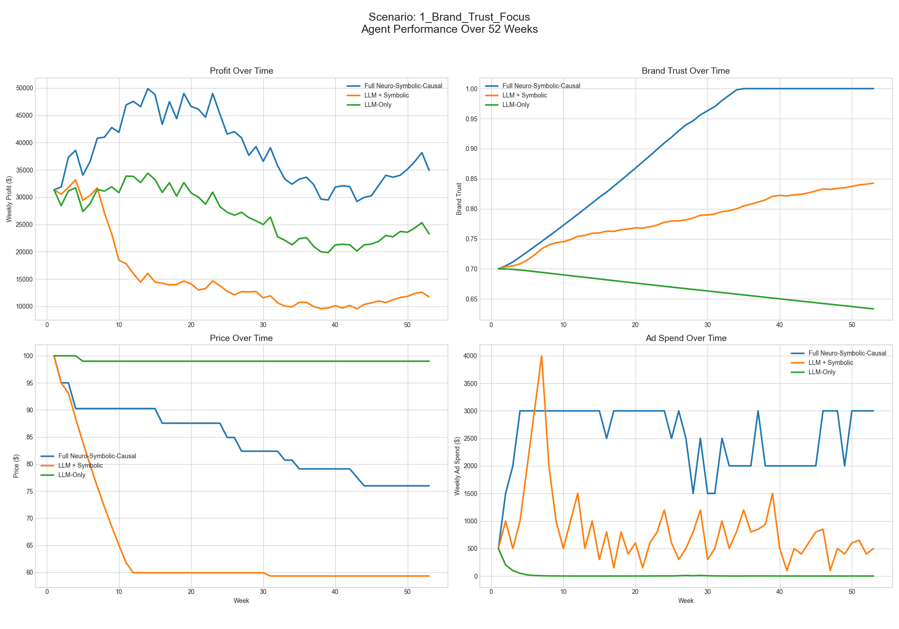
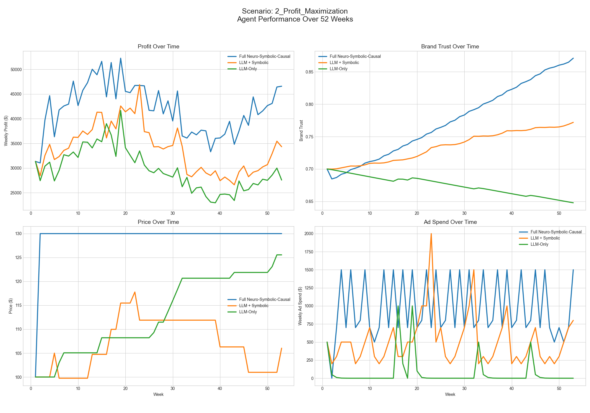

# Project Chimera: A Neuro-Symbolic-Causal AI Agent for Strategic Decision-Making

[](https://opensource.org/licenses/MIT)
[](https://www.python.org/downloads/)
[](http://makeapullrequest.com)

**Project Chimera is an advanced AI agent designed to overcome the critical limitations of standard Large Language Models (LLMs) in strategic business environments. By integrating a hybrid Neuro-Symbolic-Causal architecture, this agent makes decisions that are not only intelligent but also safe, explainable, and provably profitable.**

---

## ❗ The Problem: Why Raw LLMs are Dangerous for Business

Modern LLMs are powerful, but when entrusted with critical business decisions, they can be dangerously naive and unpredictable. Without proper guardrails, they can make catastrophic mistakes. Our benchmark experiment proves this: we tasked a pure `LLM-Only` agent with managing a simulated e-commerce business for one year. Lacking an understanding of rules or the causal consequences of its actions, it drove the company into a **multi-billion dollar loss**.

---

## 💡 The Solution: The Chimera Agent in Action

Project Chimera solves this by providing the LLM with a **Symbolic** safety net and a **Causal** oracle. It doesn't just guess; it brainstorms multiple strategies, checks them against business rules, and predicts their financial outcomes to find the optimal path.

You can try a **live demo** of the Strategy Lab here:

<a href="https://project-chimera.streamlit.app/" target="_blank"></a>

**See Chimera in Action**


---

## 🧩 The Chimera Architecture


* **🧠 Neuro (The Brain):** The creative core (GPT-4o) that understands goals and brainstorms diverse strategies.  
* **🛡️ Symbolic (The Guardian):** A rule engine that acts as a safety net, preventing catastrophic, rule-breaking decisions.  
* **🔮 Causal (The Oracle):** A data-driven causal inference engine (`EconML`) that predicts the profit impact of potential decisions.

---

### ✨ Key Features

* **Multi-Hypothesis Reasoning:** The agent actively brainstorms and evaluates multiple strategies before making a data-driven recommendation.
* **Dynamic Learning from Experience:** The agent's Causal Engine (CausalEngineV6) retrains periodically on its own performance data, allowing it to adapt and improve.
* **Advanced XAI Suite:** Go beyond "black box" predictions with:
    * **Per-Decision Explainability:** A SHAP-based panel that shows the factors driving each specific decision.
    * **Interactive 'What-If' Simulator:** A tool to explore the agent's mind by changing market conditions and seeing how its predictions change in real-time.
* **Advanced Economic Simulator:** A sophisticated simulation environment featuring non-linear dynamics like price elasticity and diminishing returns.
* **Interactive Strategy Lab:** A full-featured Streamlit application (`app.py`) for real-time interaction and analysis.
* **Automated Benchmarking Suite:** A powerful research script (`benchmark.py`) to rigorously compare different agent architectures.

---

## 📈 Evolution & Development Report (Release v1.2.1)
This version represents a major leap forward, transforming Project Chimera from a powerful prototype into a robust, transparent, and interactive analysis platform.

- **🧠 Core Intelligence Upgrade (CausalEngineV6):** Fixed a fundamental statistical flaw ("data leakage") in the training data generation process. The Causal Engine now produces live, dynamic, and meaningful predictions, moving from a "dead brain" to a fully operational one.

- **🔬 Explainability (XAI) Suite:**
    * **Static SHAP Panel:** Integrated a panel to display the positive and negative factors for each decision, turning the "black box" into a "glass box."
    * **Interactive 'What-If' Simulator:** Added a new tab where users can tweak market conditions and proposed actions with sliders to see the Causal Engine's predictions and explanations update in real-time.

- ✨ **UI/UX Overhaul:**
    * **Tabbed Interface:** Re-organized the app into logical tabs: Strategy Lab, Performance Dashboard, and Run History.
    * **Focused Dashboard:** Redesigned the performance dashboard into a cleaner 2x2 layout for the most critical metrics.
    * **Delta Metrics & Run Log:** Added week-over-week change indicators and a professional log table for detailed analysis of past runs.

- 🛠 **Code Health & Bug Squashing:** Resolved numerous bugs, including library versioning conflicts with LangChain and UI state issues, to create a more stable and reliable application.

---

## 🔬Advanced XAI: From Glass Box to Interactive Simulator
Version 1.2.1 introduces a full suite of XAI tools. We didn't just want to see why the agent made a decision; we wanted to interact with its reasoning. The new **"What-If Analysis"** tab allows you to do exactly that—explore the agent's mind by testing counterfactual scenarios live.

See the Interactive 'What-If' Simulator in Action:


---

## 📊 Benchmark Results Across Strategic Scenarios

### 1. Brand Trust Focus



| Agent Type                  | Total Profit (Cumulative) | Avg. Weekly Profit | Final Brand Trust | Final Price | Final Ad Spend |
|-----------------------------|---------------------------|--------------------|-------------------|-------------|----------------|
| **Full Neuro-Symbolic-Causal** | $2,032,412.65             | $38,347.41         | **1.000**         | $75.97      | $3000.00       |
| LLM-Only                    | $1,418,021.20             | $26,755.12         | 0.633             | $99.00      | $0.10          |
| LLM + Symbolic              | $812,497.59               | $15,330.14         | 0.843             | $59.31      | $500.00        |

---

### 2. Profit Maximization



| Agent Type                  | Total Profit (Cumulative) | Avg. Weekly Profit | Final Brand Trust | Final Price | Final Ad Spend |
|-----------------------------|---------------------------|--------------------|-------------------|-------------|----------------|
| **Full Neuro-Symbolic-Causal** | $2,226,910.00             | $42,017.17         | 0.871             | $130.00     | $1500.00       |
| LLM + Symbolic              | $1,795,430.20             | $33,876.04         | 0.772             | $106.03     | $800.00        |
| LLM-Only                    | $1,571,889.33             | $29,658.29         | 0.648             | $125.56     | $0.05          |

---

### 3. Balanced Strategy


| Agent Type                  | Total Profit (Cumulative) | Avg. Weekly Profit | Final Brand Trust | Final Price | Final Ad Spend |
|-----------------------------|---------------------------|--------------------|-------------------|-------------|----------------|
| **Full Neuro-Symbolic-Causal** | ~$1,612,000               | ~$31,362.00        | ~0.773            | ~$100.15    | ~$3000.00      |
| LLM + Symbolic              | ~$1,320,000               | ~$25,443.10        | ~0.643            | $100.00     | ~$25.00        |
| LLM-Only                    | ~$1,274,000               | ~$24,592.27        | ~0.638            | $100.00     | ~$0.10         |

---

### 🗺️ Future Roadmap

Project Chimera is a living project. The next steps in our vision include:
* **Multi-Agent Competitive Simulations:** Evolving the benchmark into an ecosystem where multiple Chimera agents compete against each other in the same market.
* **Domain-Agnostic Framework:** Refactoring the core logic into a general-purpose framework for other domains like finance or healthcare.
* **Autonomous Learning & Self-Improvement:** Enabling the agent to not just learn from data, but to actively run its own experiments to discover new causal relationships in the environment.
---

### 🚀 Live Demo & Usage

#### Try the Interactive Lab

You can try a live version of the Strategy Lab here:

<a href="https://project-chimera.streamlit.app/" target="_blank"></a>

---

#### Getting Started

1.  **Clone the repository:**
    ```bash
    git clone [https://github.com/akarlaraytu/Project-Chimera.git](https://github.com/akarlaraytu/Project-Chimera.git)
    cd Project-Chimera
    ```
2.  **Create a virtual environment and install dependencies:**
    ```bash
    python3 -m venv venv
    source venv/bin/activate
    pip install -r requirements.txt
    ```
3.  **Set your OpenAI API Key:**
    ```bash
    export OPENAI_API_KEY='sk-...'
    ```
4.  **Run the Interactive Demo:**
    ```bash
    streamlit run app.py
    ```
5.  **Run the Automated Benchmarks:**
    ```bash
    python3 benchmark.py
    python3 benchmark_learning.py
    ```
     
---

### 🤝 Contributing

Contributions, issues, and feature requests are welcome! Feel free to check the [issues page](https://github.com/akarlaraytu/Project-Chimera/issues).

### 📄 License

This project is licensed under the MIT License - see the [LICENSE.md](LICENSE.md) file for details.

---

*Developed with passion by [Aytug Akarlar](https://www.linkedin.com/in/aytuakarlar/) in collaboration with a strategic AI partner.*
